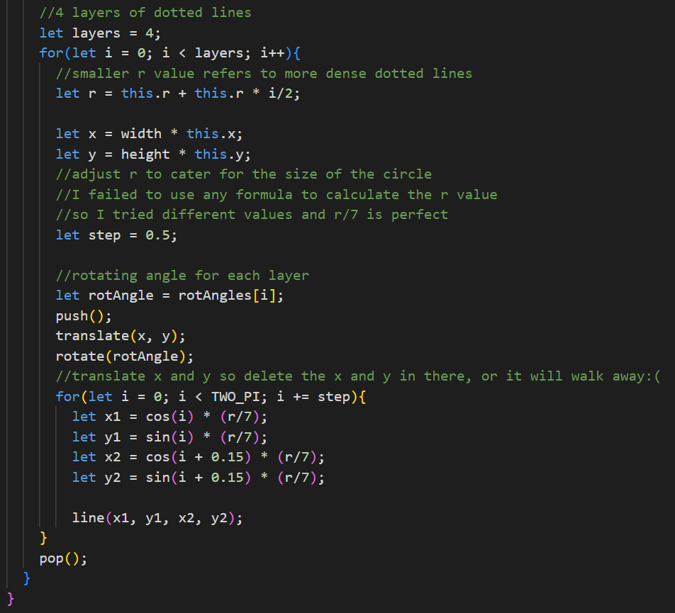
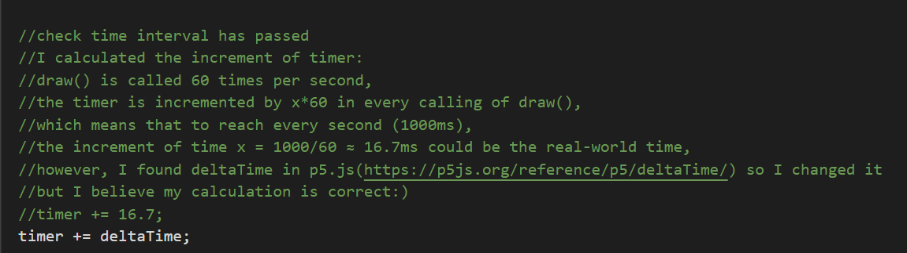
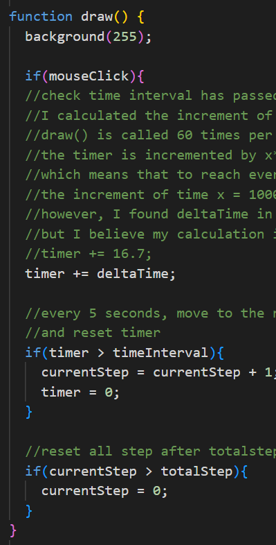

# Individual-project
**Note: The group work has not been finished completely yet, everyone maybe add some ditails to perfect the work,
so I started parts of my individual work based on the progress of the group work to ensure I can submit on time.
Eventually, my individual task will contain the completed group project coding. The changes I made are explained here.**

**Link of group project:**
https://github.com/rasu0036/Group-B.git

**My individual task: Time-Based:Employ timers and events for animation.**

Details of my individual approach:(comments have further details):

1. The dotted line circles are **rotating** based on stepInterval and function autoClock()

- Technical explanation:
  - The ratations with 4 layers of dottedline circles by *setInterval()* taught in tutorial 5, and each layer rotates at different speed.
  I initialized the rotating angles and calling speed:
*let rotAngles = [0, 0, 0, 0];
let stepInterval = 100;*

  - A function to differ speed in 4 layers:
*function autoClock(){
  rotAngles[0] += 0.01;
  rotAngles[1] += 0.02;
  rotAngles[2] += 0.015;
  rotAngles[3] += 0.025;
}*
Rotating each layer by *rotate()* in the nested for-loop, so every layer matches *rotAngles[i]*

2. The patterns in each large circle **appear in chronological order**, the **timer is 5 sconds**.

- Technical explanation:
  - At first, I defined these elements, which are necessary for this time-based animation:
*let timer = 0;
let currentStep = 0;
let totalStep = 6;
let timeInterval = 5000;*
There are currently 6 pattern types, so totalStep is 6. And I want them appear sequentially 5s, so timeInterval is 5000ms.

  - In draw(), I calculated timer increment in one calling one time, which could be 60 framecounts per second.

The timer is incremented by x*60 in every calling of *draw()*, which means that to reach every second (1000ms).
So the increment of time **x = 1000/60 ≈ 16.7ms** could be the real-world time,
However, I found deltaTime in **p5.js(https://p5js.org/reference/p5/deltaTime/)** so I changed it.
(I also commentted it)

  - Then, I started my if conditions
Since I need to keep the results of each step, I didn't use the elseif.
Making sure every step running after **5000ms**
  *if(timer > timeInterval){
    currentStep = currentStep + 1;
    timer = 0;
  }*
When all steps finished, reset the animation.
  *if(currentStep > totalStep){
    currentStep = 0;
  }*

3. The event: *mousePressed()*, when click the secreen, animation starts

- Technical explanation:
  - First, define the *mouseClick = false*, and add:
  *function mousePressed(){
  if(!mouseClick){
    mouseClick = true;
  }}*
  - Then add the event at the beginning of animation:
  
